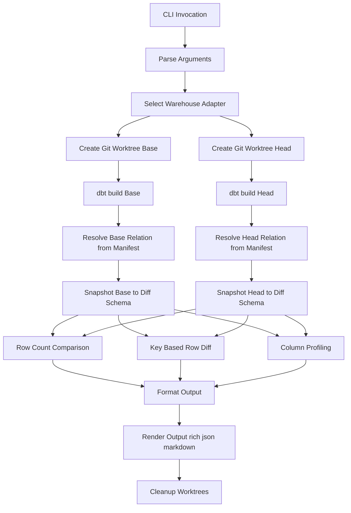

<p align="center">
  
</p>

# dbt-model-diff

> Compare **dbt model outputs at the data level** across Git branches.


## Problem Statement

Modern analytics engineering workflows rely heavily on Git-based collaboration and dbt-driven transformations. When reviewing changes to a dbt model, teams typically evaluate:

- SQL diffs  
- Compiled artifacts  
- dbt manifest changes  

However, none of these approaches directly answer the most critical question:

> **Did this change alter the actual data?**

A seemingly small SQL modification — such as a filter adjustment, join condition tweak, or column transformation — can:

- Introduce silent row drops  
- Create duplicate records  
- Modify aggregated values  
- Change null distributions  
- Alter schema shape  

These issues often go undetected until after deployment.

In CI pipelines and pull request reviews, there is currently no lightweight, warehouse-native way to:

- Build a model on two Git branches  
- Compare the resulting datasets deterministically  
- Quantify row-level differences  
- Detect schema changes  
- Surface statistical shifts  

This gap makes refactoring risky and slows down innovation in data teams.

---

## Objective

`dbt-model-diff` aims to solve this by providing a simple CLI tool that:

- Builds a dbt model on two Git refs  
- Compares the resulting data outputs  
- Reports deterministic differences  
- Integrates cleanly with CI workflows  
- Works across multiple warehouses  

All without modifying the dbt project or introducing intrusive macros.

---

## Architecture Overview

`dbt-model-diff` performs deterministic, data-level comparisons by building a dbt model on two Git refs (base + head), snapshotting the results into an isolated diff schema, and comparing them using warehouse-native SQL.

---

## Core Components

| Component | Location | Responsibility |
|------------|-----------|----------------|
| CLI | `cli.py` | Parses arguments, selects adapter, invokes diff flow, chooses output formatter |
| Diff Orchestrator | `core/diff_flow.py` | Coordinates full workflow (worktrees → build → snapshot → compare → cleanup) |
| dbt Runner | `core/dbt_runner.py` | Executes `dbt build` inside Git worktrees |
| Manifest Resolver | `core/manifest.py` | Reads `target/manifest.json` to identify built relations |
| Warehouse Adapters | `adapters/` | Warehouse-specific SQL (CTAS copy, quoting, profiling, hashing) |
| Formatters | `formatters/` | Renders output in `rich`, `json`, or `markdown` formats |
| Integration Tests | `tests/integration/` | Docker-based end-to-end validation |

---

## Execution Flow

### Step-by-step

1. Create Git worktrees for `base` and `head`
2. Run `dbt build` in each worktree
3. Resolve built table from `manifest.json`
4. Copy tables into isolated diff schema:
   - `{model}__base`
   - `{model}__head`
5. Compare:
   - Row counts
   - Key-based row differences
   - Schema changes
   - Column statistics
6. Render results in selected format
7. Clean up worktrees

---

## Architecture


---

## 📦 Installation

### Current Installation (Development Mode)

Until the package is published to PyPI, install it locally using editable mode.

### 1️⃣ Clone the Repository

```bash
git clone https://github.com/<your-username>/dbt-model-diff.git
cd dbt-model-diff
```
2️⃣ (Recommended) Create a Virtual Environment
```bash
python -m venv .venv
source .venv/bin/activate   # macOS / Linux
# OR
.venv\Scripts\activate      # Windows
```
3️⃣ Install in Editable Mode
```bash
pip install -e .
```
Optional: Install Test Dependencies
```bash
pip install pytest dbt-postgres
make e2e-test
```
✅ Verify Installation
```bash
dbt-model-diff --help
```


# dbt-model-diff — Usage

---

## Basic Command

```bash
dbt-model-diff diff <model_name> \
  --base <base_git_ref> \
  --head <head_git_ref> \
  --keys <comma_separated_primary_keys> \
  --profiles-dir <path_to_profiles.yml> \
  --project-dir <path_to_dbt_project> \
  --format <rich|json|markdown>
```

---

## Command Arguments

| Argument        | Required | Description                                                      | Example                  |
|-----------------|----------|------------------------------------------------------------------|--------------------------|
| `model_name`    | Yes      | Name of the dbt model to compare                                 | `dim_customers`          |
| `--base`        | Yes      | Git reference for the base branch                                | `main`                   |
| `--head`        | Yes      | Git reference for the head branch                                | `feature/update-model`   |
| `--keys`        | No       | Comma-separated primary key columns for row-level comparison     | `customer_id`            |
| `--profiles-dir`| Yes      | Path to directory containing `profiles.yml`                      | `.`                      |
| `--project-dir` | Yes      | Path to dbt project root directory                               | `.`                      |
| `--format`      | No       | Output format: `rich` (default), `json`, or `markdown`           | `json`                   |

---

## Example Command

```bash
dbt-model-diff diff dim_customers \
  --keys customer_id \
  --base main \
  --head feature/include-4 \
  --profiles-dir . \
  --project-dir . \
  --format rich
```

---

## 📊 Output Formats

| Format     | Purpose                                 |
|------------|------------------------------------------|
| `rich`     | Human-readable CLI output (default)      |
| `json`     | CI pipelines and automation              |
| `markdown` | Pull request comments and documentation  |


## Rich Output (Default)

```
╭──────────── dbt-model-diff (data) ────────────╮
│ Model: dim_customers                          │
│ Base:  main                                   │
│ Head:  feature/include-4                      │
╰────────────────────────────────────────────────╯

Summary
────────────────────────
Base rowcount:    3
Head rowcount:    4
Added rows:       1
Removed rows:     0
Changed rows:     0

Schema Changes
────────────────────────
No column differences detected.

Column Profile
────────────────────────
customer_id:
  % nulls (base): 0.0
  % nulls (head): 0.0
  uniqueness (base): 1.0
  uniqueness (head): 1.0
```

---

## JSON Output (CI-Friendly)

Run with:

```bash
--format json
```

Example output:

```json
{
  "model": "dim_customers",
  "base_ref": "main",
  "head_ref": "feature/include-4",
  "rowcounts": {
    "base": 3,
    "head": 4
  },
  "row_diff": {
    "added": 1,
    "removed": 0,
    "changed": 0
  },
  "schema_diff": {
    "added_columns": [],
    "removed_columns": []
  }
}
```

---

## Markdown Output (PR-Ready)

Run with:

```bash
--format markdown
```

Example output:

```markdown
### dbt-model-diff Report

**Model:** dim_customers  
**Base:** main  
**Head:** feature/include-4  

| Metric        | Value |
|---------------|-------|
| Base rows     | 3     |
| Head rows     | 4     |
| Added rows    | 1     |
| Removed rows  | 0     |
| Changed rows  | 0     |

_No schema differences detected._
```
## 🗄️ Supported Databases

`dbt-model-diff` is designed with an adapter abstraction layer, allowing support for multiple warehouses.

### Currently Supported

| Database   | Status      | Notes |
|------------|------------|-------|
| PostgreSQL | Supported  | Fully tested with Docker-based integration tests |
| Redshift   | Supported  | Compatible via Postgres-based adapter implementation |

---

### Work In Progress

| Database    | Status | Notes |
|------------|--------|-------|
| Snowflake  | WIP    | Adapter implementation in progress |
| BigQuery   | Planned| Pending adapter abstraction extension |
| Databricks | Planned| Future roadmap item |

---

### Architecture Note

The warehouse-specific logic is isolated inside the `adapters/` module.  

This includes:

- Identifier quoting
- CTAS snapshot creation
- Column metadata retrieval
- Row hashing logic
- Profiling queries

Adding support for a new database typically requires:

1. Implementing a new adapter class  
2. Registering it in the adapter factory  
3. Writing integration tests  

No changes to the orchestration layer are required.

---

## Support the Project

If you find this project useful, please consider:

- ⭐ Starring the repository
- Sharing it with your data engineering network
- Opening issues or contributing improvements

Your support helps improve and expand the project.

---

## About the Author

Built with ❤️ by **Rahul Rajasekharan**  

Senior Data Engineer & Open Source Contributor  

If you’d like to see more of my work, visit:

🌐 https://www.rahulrajasekharan.dev/

I build tools that make data platforms safer, faster, and more reliable.